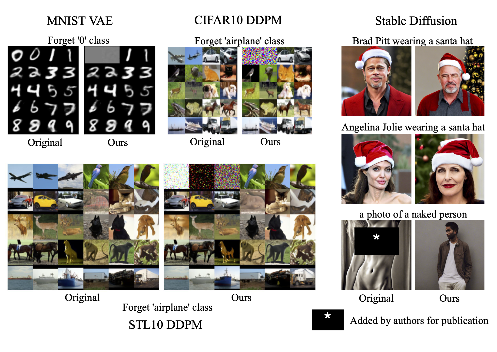

<div align="center">

# Selective Amnesia: A Continual Learning Approach for Forgetting in Deep Generative Models

[](https://arxiv.org/abs/2305.10120)
[](https://opensource.org/licenses/MIT)
[](https://nips.cc/)

</div>

<p align="center">
  
  <br />
  <span>Figure 1: Qualitative results of our method, Selective Amnesia (SA). SA can be applied to a variety
of models, from forgetting textual prompts such as specific celebrities or nudity in text-to-image
models to discrete classes in VAEs and diffusion models (DDPM).</span>
</p>


This is the official code repository for the NeurIPS 2023 Spotlight paper [Selective Amnesia: A Continual Learning Approach for Forgetting in Deep Generative Models](https://arxiv.org/abs/2305.10120).

The code is split into three subfolders, one each for VAE, DDPM and Stable Diffusion experiments. Detailed instructions are included in the respective subfolders.

## Contact
If you have any questions regarding the code or the paper, please email [Alvin](mailto:alvinh@comp.nus.edu.sg).

## BibTeX
If you find this repository or the ideas presented in our paper useful, please consider citing.
```
@article{heng2023selective,
  title={Selective Amnesia: A Continual Learning Approach to Forgetting in Deep Generative Models},
  author={Heng, Alvin and Soh, Harold},
  journal={arXiv preprint arXiv:2305.10120},
  year={2023}
}
```
